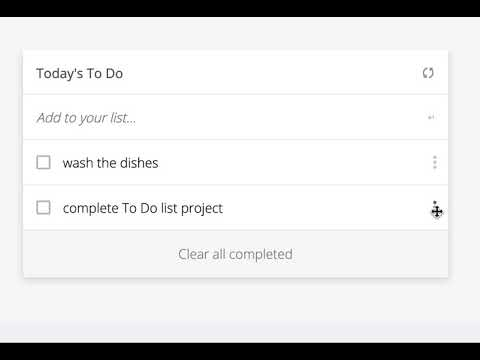

<!-- TABLE OF CONTENTS -->

# 📗 Table of Contents

- [📗 Table of Contents](#-table-of-contents)
- [📖-About-the-Project ](#-about-the-project-)
  - [🛠 Built With ](#-built-with-)
    - [Tech Stack ](#tech-stack-)
    - [Key Features ](#key-features-)
  - [🚀 Live Demo ](#-live-demo-)
  - [💻 Getting Started ](#-getting-started-)
    - [Prerequisites](#prerequisites)
    - [Setup](#setup)
    - [Install](#install)
    - [Usage](#usage)
    - [Run tests](#run-tests)
    - [Deployment](#deployment)
  - [👥 Author ](#-author-)
  - [🔭 Future Features ](#-future-features-)
  - [🤝 Contributing ](#-contributing-)
  - [⭐️ Show your support ](#️-show-your-support-)
  - [🙏 Acknowledgments ](#-acknowledgments-)
  - [📝 License ](#-license-)
<!-- PROJECT DESCRIPTION -->

# 📖-About-the-Project 

-**[LiveDemo]**(https://harshi0102.github.io/todolist/)

**To-do-list** is a project done for the activity "To Do list: list structure" of the Microverse Program. The goal is to to learn use webpack and javascript ES6.
In this project, you will build a simple HTML list of To Do tasks. The list will be styled according to the specifications listed later in this lesson. This simple web page will be built using webpack and served by a webpack dev server.

## 🛠 Built With 
- HTML
- CSS
- JavaScript

### Tech Stack 
- Git and Github
- VS-code
- JavaScript
- HTM
- CSS
- Webpack

### Key Features 

- **Use Webpack**
- **Use ES6**
- **Use Add/Update/Remove Tasks**
- **Drag and Drop task feature**

(<a href="#readme-top">back to top</a>)

  
Client

  <ul>
    <li><a href="https://developer.mozilla.org/es/docs/Web/HTML">HTML</a></li>
    <li><a href="https://developer.mozilla.org/es/docs/Web/CSS">CSS</a></li>
    <li><a href="https://developer.mozilla.org/es/docs/Web/CSS">JavaScript</a></li>
  </ul>

 

(<a href="#readme-top">back to top</a>)

 
<!-- LIVE DEMO -->
 
## 🚀 Live Demo 
 
- [LIVE-DEMO](<a href="#">(https://harshi0102.github.io/todolist/)
 

(<a href="#readme-top">back to top</a>)

 
<!-- GETTING STARTED -->
 
## 💻 Getting Started 
 
To get a local copy up and running, follow these steps.
 
### Prerequisites
 
In order to run this project you need:
 
- A computer.
- Internet access.
- A modern web browser.
 
### Setup
- For detail description of how to get started with webpack, please, look at: [webpack](https://webpack.js.org/guides/getting-started/)

### Install

- [Git](https://git-scm.com/downloads)
- [Node](https://nodejs.org/en/download/)
 
### Usage

- Clone the repository using "`https://github.com/harshi0102/todolist.git`"
- Change directory into the project folder `cd todolist`
- Run `npm install`
- Run `npm start`
- A new browser will open automatically with application loaded
 
### Run tests

- Passed Lighthouse, webhint, Stylelint and ESLint tests

### Deployment

- All the files necessary for deployment are in the `/dist` folder

<!-- AUTHORS -->
 
## 👥 Author 

👤 **Harshika Govind**

- GitHub:(https://github.com/harshi0102)
- Twitter: (https://twitter.com/harshika0102m2)
- LinkedIn:(https://www.linkedin.com/in/harshikagovind/)

(<a href="#readme-top">back to top</a>)

 
<!-- FUTURE FEATURES -->

## 🔭 Future Features 

- [x] **Drag and Drop task**
- [x] **Personnalize the style**
 

(<a href="#readme-top">back to top</a>)

- [ ] **Homepage**

(<a href="#readme-top">back to top</a>)

## 🤠Contributing 

Contributions, issues, and feature requests are welcome!

Feel free to check the [issues page](https://github.com/harshi0102/todolist/issues).

(<a href="#readme-top">back to top</a>)

 
<!-- SUPPORT -->
 
## ⭐️ Show your support 
 
If the project was great as your view, don't hesitate to share and give it a star.
 

(<a href="#readme-top">back to top</a>)

 
<!-- ACKNOWLEDGEMENTS -->
 
## 🙠Acknowledgments 
 
I would like to thank Microverse

(<a href="#readme-top">back to top</a>)

 
<!-- LICENSE -->
 
## 📠License 
 
This project is [MIT](https://github.com/harshi0102/todolist/blob/main/LICENSE) licensed.
 

(<a href="#readme-top">back to top</a>)

<!-- README.md
Displaying README.md. -->
